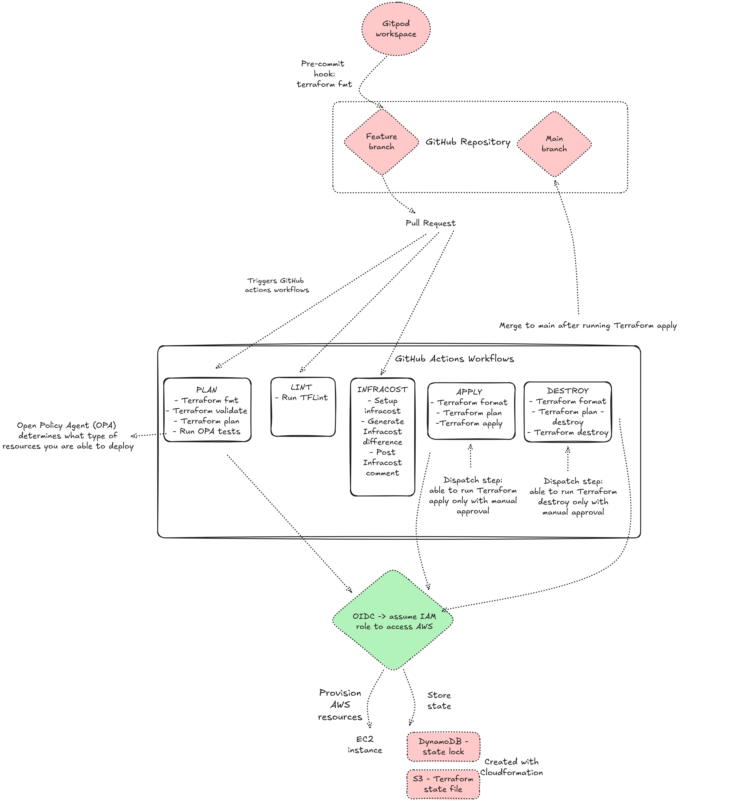

## Gitops for Terraform

This project was created as part of the [GitOps for Terraform minicamp](https://courses.morethancertified.com/p/gitops-with-terraform). The goal of this project is to build a 
fully functional GitOps pipeline to deploy AWS infrastructure using Terraform.

This Terraform project creates a simple Grafana server with related resources such as internet gateway and route table. The purpose of this project is to concentrate on the pipeline and different functionalities that would ensure that the pipeline contains required mechanisms and quardrails to make sure that it will be used as intended.

The structure of this project is summarized in the below diagram:

The general principle of the Pipeline is that creating a pull request will trigger a few separate Github actions worfklows. These will run different validations, check the cost implications and make sure that they follow the set policies. If each of these tests pass, it is possible to move on to the running 'Terraform apply'. This will be done with a separate dispatch step, which means that it needs to be done manually via the Github actions console. This is the easiest way to make sure that there is a human intervention before deployment. Similarly running 'terraform destroy' would need to be triggered manually. 

The way that pipeline is designed means that the infrastructure is always the 'source of truth'. Main branch could be behind as merging the feature branch to the main branch would happen only after successfull infrastructure deployment. 

## Main branch protection

The settings for the Github repository should be changed so that it is not possible to push directly to the main branch. Rather the code should always be pushed to a feature branch and a pull request should be created to merge to main.

Merging should also not be possible unless all of the below explain workflows have completed successfully.

## Pre-requisites

### Backend resources

The backend resources are stored in an AWS S3 bucket and DynamoDB. The state file itself is stored in the S3 bucket, whereas DynamoDB contains one table with only one item that would be the lock in case a workflow is currently doing updates to the state file. This is to make sure that two resources are not able to update the state file at the same time, which would lead to conflicts. These resources are described with Cloudformation in the 'cfn' directory and you need to create these either using the the CloudFormation console directly in the console or AWS CLI before starting to work with the Terraform project.

### OIDC-role

OIDC (OpenID Connect) is the role that your actions workflow will assume to get access to your AWS account. This is a very secure way of creating access as it will create temporary credentials that are destroyed as soons as the workflow finishes executing.

The OIDC role is defined with Cloudformation in the 'cfn' directory. You can create the role directly in the AWS console. After creating the role, you need to add the role name as a Github secret called 'ROLE_TO_ASSUME' so that your Github actions workflow knows which role to use to access AWS.

### Pre-commit hook

The purpose of pre-commit hooks is to check your code before you are able to commit it. In this pipeline I create a 
pre-commit hook that runs 'terraform fmt' in order to make sure that the code is correctly formatted.

The terraform fmt pre-commit hook was set up using this [library](https://github.com/antonbabenko/pre-commit-terraform?tab=readme-ov-file#terraform_fmt). If formatting fails when trying to commit code, it will make changes to the files to format them correctly and you would then need to run git add and git commit again.

## GitHub Actions workflows

Three of the workflows: infracost, plan and Lint run in parallel after a pull request has been created. All of these three workflows need to complete their checks successfully before you are able to merge the code to the main branch.

### Infracost -workflow

Setting up [Infracost](https://www.infracost.io/) requires you to create an account and API Key. This token needs to be added as 'INFRACOST_API_KEY' to GitHub secrets.

The infracost.yml file creates a new job for infracost, which checks the current infrastrucutre and then checks how much the resources on the new pull request would cost. It will calculate the difference and create an easily understandable comment with 'post infracost comment' step.

### Plan -workflow

The plan workflow runs again 'Terraform fmt' in order to make sure that it is done, in case you would have some contributors that are not running it in the pre-commit hook. In addition it will run 'terraform validate', which checks for syntax errors and provider schema compliance. The workflow will configure AWS credentials using the OIDC-role and then run 'terraform plan'. It will also set up OPA and run the OPA tests.

### OPA (Open Policy Agent)

OPA code is written in REGO, which is a robust language for these type of policies. The idea is that you can create quardrails that all developers committing code would have to follow. In this project, the policy allows only certain instance types (t3.micro and t3.small) to be deployed. 

Rego playground makes it straightforward to define a policy and then testing with different terraform plan scripts whether those would pass the policy. Trying to deploy any other than the above mentioned two resources will now make this workflow to result in error. 

## Lint -workflow

tflint.yml file sets up tflint and then runs it. This job is running parallel to the plan workflow. It will identify potential errors in the Terraform code and make sure that you follow best practises.

## Apply and destroy -workflows

We want these workflows to run only with manual intervention. The easiest way to implement this is my using a dispatch step:

``
name: 'Apply'

on: workflow_dispatch
``

With the current set-up you will need to make sure that all of the three workflows that are run after the pull request is created, successfully complete their checks. After that you can go to the GitHub Actions tab, select the 'apply' workflow and manually run it by clicking 'Run workflow'. The same can be done for destroying the resources.

After the resources have been applied successfully, you can go ahead and merge the feature branch to main.